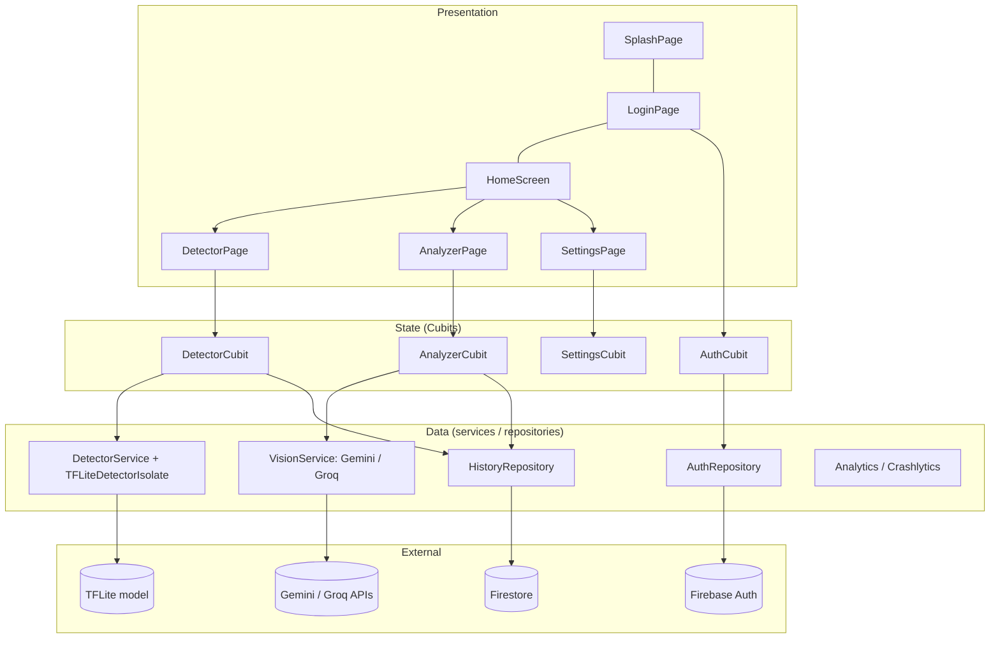

# Vision Companion — Technical Documentation

Vision Companion is an assistive-vision mobile app (Flutter) for blind and low-vision users. It turns the camera feed into spoken/announced feedback in **English and Hindi** through two features:

1. **Live Object Detector** — on-device TensorFlow Lite detection of everyday objects in real time.
2. **AI Image Analyzer** — a captured photo is described in natural language by a cloud vision model (Google Gemini, with Groq as a fallback).

This document covers: [architecture](#2-architecture), [feature walkthroughs](#3-feature-walkthroughs), [Firebase setup](#4-firebase-setup), [running the project](#5-running-the-project), and [known limitations](#6-known-limitations).

---

## 1. Tech Stack

| Area | Technology |
|---|---|
| Framework | Flutter / Dart (`sdk: ^3.13.1` per `pubspec.yaml`) |
| State management | `flutter_bloc` (Cubit) + `equatable` |
| Navigation | `go_router` with auth/language redirects |
| Dependency injection | `get_it` (`lib/core/di/injection_container.dart`) |
| Camera | `camera` (YUV420 image stream for detection, `takePicture` for analysis) |
| On-device ML | `tflite_flutter`, SSD MobileNet v1 (`assets/models/2.tflite`), run in a Dart isolate |
| Cloud vision | Google Gemini REST API (primary), Groq `llama-4-scout` (fallback) |
| Backend services | Firebase Auth, Cloud Firestore, Crashlytics, Analytics |
| Sign-in | Email/password, Google Sign-In (v7 API) |
| Localization | ARB files + `flutter gen-l10n`, ICU plural/select |
| Accessibility | `Semantics`, `SemanticsService.announce`, haptics, 48×48 dp tap targets |
| Local storage | `shared_preferences` (language choice) |
| Android build | AGP 9.1.0, Gradle 9.3.1, Kotlin 2.4.0, `minSdk 24`, Java 17 |

---

## 2. Architecture

### 2.1 Layered, feature-first structure

The app follows a feature-first Clean Architecture with three layers per feature: **presentation** (pages/widgets) → **state** (Cubits) → **data** (services/repositories).

```
lib/
├── main.dart                      # Bootstrap: dotenv → Firebase → DI → Crashlytics → runApp
├── firebase_options.dart          # Generated by FlutterFire CLI
├── core/
│   ├── constants/app_constants.dart   # Routes, pref keys, feature types, limits
│   ├── di/injection_container.dart    # get_it registrations
│   ├── router/app_router.dart         # go_router config + redirect guard
│   ├── services/                      # AnalyticsService, CrashlyticsService (abstract + Firebase impl)
│   ├── theme/                         # AppTheme, AppColors (high-contrast black & white)
│   └── widgets/                       # AppLogo, LanguageToggleButton
├── features/
│   ├── splash/pages/                  # First-launch language picker
│   ├── auth/                          # cubit, repository, pages, widgets
│   ├── home/home_screen.dart          # Greeting, 2 feature cards, profile sheet
│   ├── detector/                      # cubit, services (+isolate), models, widgets, constants
│   ├── analyzer/                      # cubit, services (Gemini/Groq), models, pages
│   ├── history/                       # HistoryRepository (Firestore) + HistoryEntry
│   └── settings/                      # SettingsCubit, SettingsPage, LanguageSelectorTile
└── l10n/                              # app_en.arb, app_hi.arb + generated app_localizations*.dart
```

### 2.2 Layer diagram



### 2.3 State management

Every screen is driven by a **Cubit** with immutable, `Equatable` states.

| Cubit | States | Notes |
|---|---|---|
| `SettingsCubit` | `SettingsState(locale, themeMode)` | Persists language in `SharedPreferences`; `hasSelectedLanguage` drives the splash redirect. |
| `AuthCubit` | sealed `AuthState`: `Unauthenticated`, `Loading`, `Authenticated`, `AuthError` | Subscribes to `authStateChanges`; syncs the user ID to Crashlytics and Analytics. |
| `DetectorCubit` | `DetectorInitial/Idle`, `Running`, `Results`, `Paused`, `Stopped`, `Error` | Drops frames while one is in flight; throttles haptics (700 ms) and Firestore logging (10 s). |
| `AnalyzerCubit` | `AnalyzerIdle`, `Processing`, `Result`, `Error` | Resolves the API key, runs the vision request, parses tags, logs history and analytics. |

All Cubits override `emit` to ignore emissions after `close()`, which prevents "emit after close" errors from async work (isolate results, network calls).

### 2.4 Dependency injection

`initDependencies()` in `injection_container.dart` registers everything with `get_it`:

- **Lazy singletons:** `SharedPreferences`, `FirebaseAuth`, `FirebaseFirestore`, `GoogleSignIn`, `AuthRepository`, `HistoryRepository`, `AnalyticsService`, `CrashlyticsService`, `DetectorService`, `SettingsCubit`, `AuthCubit`, `GeminiVisionService`, `GroqVisionService`, `VisionService` (aliases Gemini).
- **Factories:** `DetectorCubit` and `AnalyzerCubit` — a fresh instance for every visit to the page (created in the router's `BlocProvider`).

Every dependency can be overridden through named parameters (`authRepository:`, `detectorService:`, …), which is how the tests inject fakes. Firebase objects are wrapped in `try/catch` so the app (and tests) still start when Firebase is not initialised.

### 2.5 Routing and guards

`AppRouter.createRouter()` builds a `go_router` with a `redirect` that runs on every navigation and whenever the auth stream emits (`GoRouterRefreshStream`):

1. Language not yet chosen → `/splash`
2. Signed out and not on `/login` → `/login`
3. Signed in and on `/login` → `/` (home)

Routes: `/splash`, `/` (home), `/login`, `/detector`, `/analyzer`, `/settings`.

### 2.6 Object-detection pipeline

```
CameraController.startImageStream (YUV420)
  → DetectorPage → DetectorCubit.processCameraImage      (drop frame if busy)
  → LiveDetectorService: copy Y/U/V planes into FrameData (second busy-guard)
  → SendPort → background isolate (TFLiteDetectorIsolate)
        · YUV420 → RGB, nearest-neighbour downsample to 300×300, rotate by sensorOrientation
        · Interpreter (2 threads) → boxes [1,10,4], classes [1,10], scores [1,10], count [1]
        · keep scores ≥ 0.50, clamp boxes to [0,1]
  → InferenceResult(detections, inferenceTimeMs)
  → DetectorCubit emits DetectorResults
  → UI: BoundingBoxPainter, HUD badge, TalkBack announcement
  → side effects: haptic, Analytics `detection_completed`, Firestore history (≤ 1 per 10 s)
```

Running inference in a separate isolate keeps the UI thread free; skipping frames while busy keeps latency bounded rather than queueing stale frames.

### 2.7 Image-analysis pipeline

```
AnalyzerPage: takePicture() → AnalyzerCubit.analyzeImage(path, languageCode)
  1. Resolve API key (first non-empty wins):
       apiKeyOverride → apiKeyProvider → --dart-define GEMINI_API_KEY
       → .env GEMINI_API_KEY (or GROQ_API_KEY) → --dart-define GROQ_API_KEY
  2. GeminiVisionService: base64-encode image, send English or Hindi prompt
       · tries each model in [defaultModel, ...candidateModels]
       · 2 attempts per model; 600 ms pause on 429/503/"overloaded"
       · 404 → next model; 401/403/invalid key → fail immediately
  3. If Gemini is overloaded / offline AND GROQ_API_KEY is set → GroqVisionService
  4. AnalysisData.parseWithTags: extract "Tags: name (95%), …" (EN/HI), else keyword heuristics
  5. Log text-only summary to Firestore, log Analytics `image_analyzed`
  6. Emit AnalyzerResult → page focuses the result and announces it
```

The image itself is **never uploaded to Firebase Storage**; only the file name, model, latency and tags are stored in history metadata.

---

## 3. Feature Walkthroughs

### 3.1 First launch and language selection (Splash)
On first launch the user sees a bilingual **language picker** (English / हिन्दी). Tapping a card calls `SettingsCubit.setLocale`, which updates the UI instantly and saves the choice. **Continue** calls `confirmLanguageSelection()` and routes to Home (signed in) or Login (signed out). On later launches the splash is skipped. Language can be changed at any time from Settings.

### 3.2 Authentication
`LoginPage` toggles between **Sign In** and **Create Account** (name, email, password, confirm password; minimum 6 characters).

- Email/password and **Google Sign-In** (`GoogleSignIn.instance.authenticate()` → ID token → Firebase credential).
- `AuthFailure` maps Firebase codes (`user-not-found`, `wrong-password`/`invalid-credential`, `email-already-in-use`, `weak-password`, `too-many-requests`, `network-request-failed`, …) to a typed enum, then to **localized** messages shown in a snackbar.
- The Google flow initialises with a `serverClientId` from `AppConstants.googleServerClientId`.

### 3.3 Home
Shows a greeting (`Hello, <name>!`), two large feature cards (Live Object Detector, AI Image Analyzer) and a profile avatar. The avatar opens a bottom sheet with profile info, **Settings** and **Sign Out**. Tapping a card also writes a small history entry.

### 3.4 Live Object Detector
1. On open, the page initialises the model (`DetectorCubit.initialize`) and the rear camera (`ResolutionPreset.medium`, YUV420), then starts the image stream and `DetectorRunning`.
2. Detections are drawn by `BoundingBoxPainter`: a double stroke (black + category colour) for contrast, and a label badge with the localized name and confidence, e.g. `PERSON 92%` or `व्यक्ति 92%`.
3. **Audio/haptics:** the top detection is announced via `SemanticsService.announce` at most once every 2 s, and the *same* label is not repeated within 10 s. A light haptic fires at most every 700 ms. **Tapping the live feed** gives an immediate summary (e.g. "2 objects detected: person, dog").
4. **Pause / Resume** button toggles the state; camera stops on app pause and restarts on resume.
5. Labels come from `CocoLabels` (80 classes) with a full Hindi dictionary (`hindiLabels`).

### 3.5 AI Image Analyzer
1. Live camera preview with a large **Capture Photo** button (disabled while processing).
2. After capture: haptic + "Analyzing image, please wait" announcement + a spinner (a live region for screen readers).
3. On success: a thumbnail, the description (2–3 sentences, tuned for text-to-speech; currency is identified with denomination first), and tag chips with confidence. The result receives focus and is announced together with the tags.
4. On failure: a friendly localized error (network / service unavailable / generic — never a raw stack trace), with **Retry** and **Take Another Photo**.
5. Prompts are sent in Hindi when the app language is Hindi.

### 3.6 Settings
Profile card (name, email, sign-in status, truncated UID), Sign In/Sign Out button, the language selector (radio-style cards with ≥ 48 dp targets) and an About card (version, crash-reporting notice). Opening Settings logs `feature_opened: settings`.

### 3.7 History (Firestore)
`FirestoreHistoryRepository` writes to `users/{uid}/history/{docId}` with `timestamp`, `featureType` (`detector` / `analyzer`), `resultSummary` and optional `metadata`. After each write it prunes the collection to the **latest 20** entries. It also exposes `getHistory`, `streamHistory` and `deleteHistoryEntry`.

### 3.8 Localization
- `l10n.yaml` points at `lib/l10n`, template `app_en.arb`, output `app_localizations.dart`. Supported locales: `en`, `hi`.
- ICU **plural** (`detectorObjectsCount`, `detectorPausedWithCount`, `analyzerTagsCount`) and **select** (`themeModeSelect`, `detectorActionSelect`) messages are used.
- After editing an ARB file, run `flutter gen-l10n`.

### 3.9 Accessibility design
- Semantic labels on every control; headers marked with `Semantics(header: true)`.
- Minimum **48×48 dp** touch targets, high-contrast black-and-white theme.
- Decorative visuals (camera preview, HUD) are wrapped in `ExcludeSemantics` so TalkBack reads one clean status string instead of duplicates.
- Focus is moved to the result/error region and announced after a short delay so TalkBack does not talk over itself.
- Haptic feedback confirms captures, results and errors.

### 3.10 Analytics and crash reporting
- Analytics events: `feature_opened`, `detection_completed`, `image_analyzed`, plus `setUserId`.
- Crashlytics captures `FlutterError.onError` and `PlatformDispatcher.onError`; collection is **disabled in debug builds** (`!kDebugMode`).
- Both services are abstracted behind interfaces and swallow errors so telemetry can never crash the app.

---

## 4. Firebase Setup

### 4.1 Create the project and register the Android app
1. Open the [Firebase Console](https://console.firebase.google.com) → **Add project**.
2. Add an **Android** app with package name `com.example.vision_companion` (or your own; keep it in sync with `applicationId` in `android/app/build.gradle.kts`).
3. Recommended: use the FlutterFire CLI, which generates `lib/firebase_options.dart` and `android/app/google-services.json`:
   ```bash
   dart pub global activate flutterfire_cli
   flutterfire configure
   ```
   Otherwise download `google-services.json` manually into `android/app/`.
4. `google-services.json` is git-ignored; every developer needs their own copy.

### 4.2 Enable Authentication
**Build → Authentication → Sign-in method**: enable **Email/Password** and **Google**.

### 4.3 Add SHA fingerprints (required for Google Sign-In)
```bash
cd android
./gradlew signingReport
```
Copy the **SHA-1** (and SHA-256) of the `debug` and `release` variants into **Project settings → Your apps → Android → Add fingerprint**, then re-download `google-services.json`.

### 4.4 Google Sign-In client ID
In `lib/core/constants/app_constants.dart`, `googleServerClientId` must be the project's **Web client ID** (Google Cloud Console → APIs & Services → Credentials → "Web client (auto created by Google Service)"). Google Sign-In fails with a generic error if this is wrong.

### 4.5 Cloud Firestore
Create a database (**Build → Firestore Database**) and publish rules that match the path the code actually writes (`users/{uid}/history/*`):

```javascript
rules_version = '2';
service cloud.firestore {
  match /databases/{database}/documents {
    match /users/{uid}/history/{docId} {
      allow read, write: if request.auth != null && request.auth.uid == uid;
    }
  }
}
```

> **Note:** the sample rules in the current `README.md` match a top-level `/history/{document=**}` collection, which does **not** match the app's `users/{uid}/history` path — writes would be denied. Use the rules above.

If you later query history with a `featureType` filter, Firestore will prompt you to create a composite index (`featureType` + `timestamp` desc); follow the link in the error message.

### 4.6 Crashlytics and Analytics
Both are wired up by the Gradle plugins (`com.google.gms.google-services`, `com.google.firebase.crashlytics`) already declared in `android/settings.gradle.kts` and `android/app/build.gradle.kts`. Crash collection is off in debug; test with a **release/profile** build. Data appears in the console after a few minutes (Analytics can take up to 24 h in the standard reports; use DebugView for immediate checks).

### 4.7 Firebase Storage
`firebase_storage` is listed in `pubspec.yaml` but **no code uploads to it** — images are analysed locally and never stored. You do not need to enable Storage.

---

## 5. Running the Project

### 5.1 Prerequisites
| Requirement | Notes |
|---|---|
| Flutter SDK | A version that satisfies `pubspec.yaml` (`sdk: ^3.13.1`; lockfile requires Flutter `>=3.47.0`) |
| JDK | 17 |
| Android SDK | `minSdk 24`; physical device recommended (camera + TFLite performance) |
| Model file | `assets/models/2.tflite` (SSD MobileNet v1, 300×300 uint8 input) |
| Firebase files | `android/app/google-services.json` and `lib/firebase_options.dart` |

### 5.2 API keys
```bash
cp .env.example .env
```
```env
GEMINI_API_KEY=your_gemini_api_key_here     # https://aistudio.google.com/
GROQ_API_KEY=your_groq_api_key_here         # optional fallback, https://console.groq.com/
```
Keys can alternatively be passed at build/run time: `flutter run --dart-define=GEMINI_API_KEY=...`. Never commit `.env`, `google-services.json` or `GoogleService-Info.plist` (all are in `.gitignore`).

### 5.3 Install, generate, run
```bash
flutter pub get
flutter gen-l10n            # regenerate localization bindings after ARB edits
flutter run                 # debug
flutter run --profile       # best for measuring detection latency
```

### 5.4 Analyse and test
```bash
flutter analyze
flutter test
```
The `test/` folder covers cubits (auth, detector, analyzer), services (Gemini/Groq with mocked `HttpClient`, analytics, crashlytics), routing redirects, localization/ICU formatting, and widget accessibility (semantics labels, 48 dp targets, announcement throttling).

### 5.5 Build a release APK
```bash
flutter build apk --release
# → build/app/outputs/flutter-apk/app-release.apk
```

---

## 6. Known Limitations

### Security and configuration
1. **API keys are bundled into the APK.** `.env` is declared under `flutter: assets:` in `pubspec.yaml`, so anyone can extract it from a release build. The Gemini key is also sent as a URL query parameter. For production, route vision calls through a backend (e.g., Cloud Functions) or use restricted keys / Firebase App Check.
2. **Release builds are signed with the debug key** and the application ID is still `com.example.vision_companion`; both must change before Play Store publication.
3. **Firestore rules in the README do not match the data path** (see §4.5).

### Feature gaps
4. **No gallery picker.** The analyzer captures from the live camera only. The `pickImageButton` string exists in the ARB files, but no image-picker dependency or UI is implemented (the README's "select an existing photo" is aspirational).
5. **No history screen.** History is written (and pruned to 20 entries) but there is no UI to view or delete it, although the repository supports it.
6. **Theme setting is inactive.** `SettingsCubit` stores a `themeMode`, but `main.dart` forces the light theme and the settings page has no theme control.
7. **Speech relies on TalkBack/VoiceOver.** Announcements use `SemanticsService.announce`, so audio only plays when a screen reader is enabled. There is no built-in text-to-speech engine.
8. **Firebase Storage dependency is unused** and can be removed to reduce app size.
9. **Camera-less fallback fails gracefully but not usefully:** without camera hardware the analyzer sends `placeholder_camera_image.jpg`, which produces an "image file does not exist" error.

### Object detection
10. **Model coupling.** Input size (300×300 uint8), the four output tensors and the 10-detection cap are hard-coded for SSD MobileNet v1. Swapping models requires code changes in `tflite_detector_isolate.dart`.
11. **Label mapping is heuristic.** `CocoLabels.getLabel` accepts 0- or 1-based IDs and uses an 80-class list; if your model's label map differs, labels may be off by one. Verify against the model's own label file.
12. **Overlay alignment.** Boxes are drawn in normalized coordinates over the whole viewport, while `CameraPreview` keeps its own aspect ratio, so boxes can be slightly offset on some devices.
13. **Low-cost preprocessing.** Nearest-neighbour downsampling and a fixed 0.50 confidence threshold favour speed over accuracy; small or distant objects may be missed.
14. **Shared detector service.** `DetectorService` is a singleton but `DetectorCubit.close()` disposes it; it is lazily re-initialised on the next visit, causing a short model-reload delay.

### AI analysis
15. **Model names may go stale.** `GeminiVisionService.candidateModels` includes several model IDs; retired ones return 404 and are skipped automatically, but each miss adds latency. Review the list periodically against Google's current model list.
16. **Worst-case latency is high.** Up to 2 attempts × 6 models with a 25 s timeout each can make a total failure take minutes.
17. **Groq is only a failover.** It is used only when Gemini is overloaded or unreachable *and* a Groq key exists. If `GEMINI_API_KEY` is missing, the cubit passes the Groq key to the Gemini service, which fails with an auth error instead of failing over.
18. **Free-tier quotas.** Gemini/Groq free tiers are rate-limited (HTTP 429), and image contents are sent to third-party servers — disclose this in a privacy policy.
19. **AI output can be wrong.** Descriptions (including currency denomination) are model-generated and must not be relied on for safety-critical or financial decisions.
20. **Tag parsing is heuristic.** If the model omits the `Tags:` line, tags are guessed with regexes/keywords; error-type classification for localized messages is done by substring matching on the message text.

### Platform and localization
21. **Android-first.** iOS/macOS Firebase options exist, but only Android is configured and tested here; iOS would also need `NSCameraUsageDescription` in `Info.plist` and its own Firebase/Google Sign-In setup.
22. **Only English and Hindi** are supported; some strings (e.g., the "Selected" badge on the splash screen, the router's error page, several service error messages) are still hard-coded in English.
23. **Requirement drift in README.** The README lists Flutter `^3.24` / Dart `^3.5` and Gemini 1.5 models, whereas `pubspec.yaml` and the code require newer SDKs and list newer model IDs — treat `pubspec.yaml` and the code as the source of truth.

---

## 7. Troubleshooting

| Symptom | Likely cause / fix |
|---|---|
| Google Sign-In fails immediately | Missing SHA-1 in Firebase, stale `google-services.json`, or wrong `googleServerClientId`. |
| "Vision recognition service is currently unavailable" | Missing/invalid `GEMINI_API_KEY`, or all models overloaded — check `.env`, tap **Retry**. |
| Detector shows "Failed to initialize TFLite model" | `assets/models/2.tflite` missing or `assets/models/` not declared in `pubspec.yaml`. |
| No boxes / no announcements | Confidence below 0.50, or TalkBack is off (announcements are silent without a screen reader). |
| Firestore `permission-denied` in logs | Security rules don't match `users/{uid}/history` (see §4.5) or user isn't signed in. |
| UI still shows old strings after ARB edit | Run `flutter gen-l10n` (and restart the app). |
| No Crashlytics data | Collection is disabled in debug; use a profile/release build. |

---

## 8. Suggested Next Steps
Add a gallery picker and a history screen, integrate a TTS engine for screen-reader-independent speech, proxy AI requests via a backend, add a theme switch, move remaining hard-coded strings to ARB files, and add CI running `flutter analyze` and `flutter test`.
